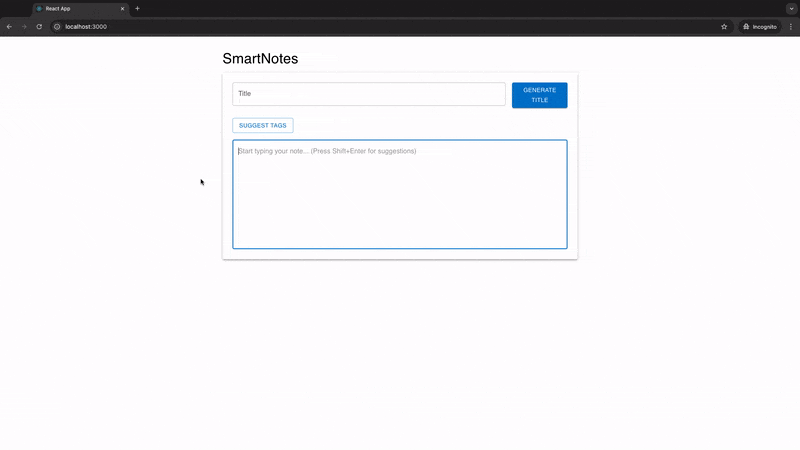

# AI-Powered React Application

This app is a proof of concept for an AI-powered notes application made with React. It's not fully polished but includes the following features:
- Auto-completion as you type
- Smart formatting suggestions
- Title generation based on content
- Tag and category suggestions

## Instructions

1. **Obtain an OpenAI API Key**: Sign up at [OpenAI](https://platform.openai.com) to get an API key.
2. **Set Up Environment Variables**: Duplicate `.env-sample`, rename the copy to `.env`, and add your API key in this file.
3. **Install Dependencies**: In the project directory, run `npm install`.
4. **Run the Application**: Execute `npm start` to launch the app in development mode, then open [http://localhost:3000](http://localhost:3000) in your browser.
